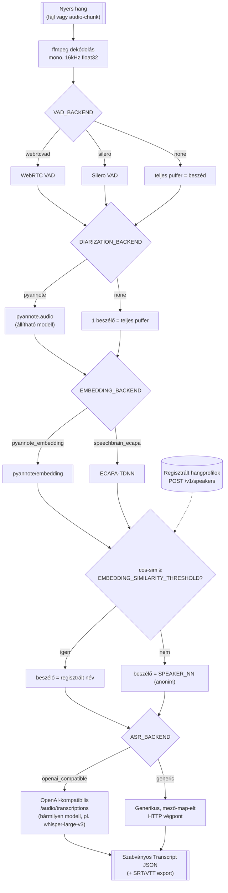
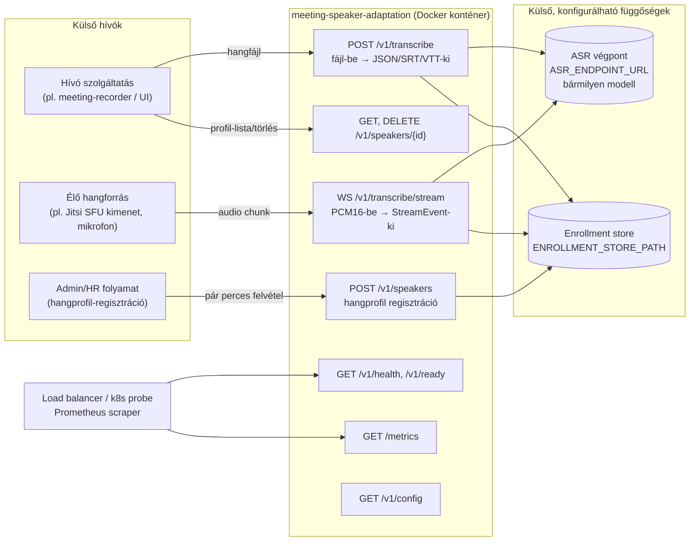
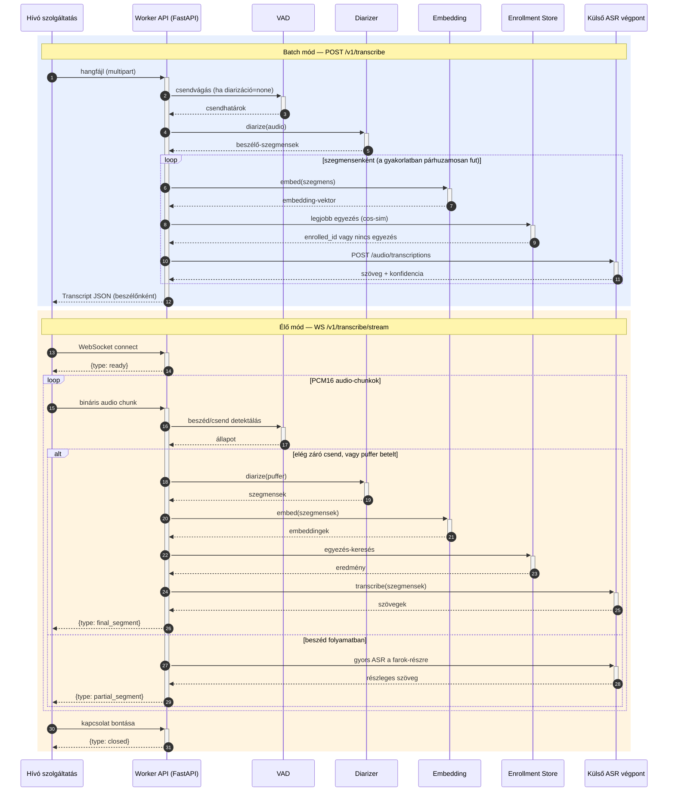

# meeting-speaker-adaptation

**Állapot: implementálva** (2026-09-11). Dockerben konténerizált, modell-agnosztikus
mikroszolgáltatás: hangfájl vagy élő hang-stream be → beszélőkre bontott,
szabványos JSON-leirat ki. Regisztrálható emberi hangprofilokkal ("enrollment"),
hogy a rendszer a saját kollégáid hangját név szerint ismerje fel egy több-beszélős
felvételben.

> Az eredeti terv-dokumentum (`git log` első commitja) ötletként szolgált ehhez az
> implementációhoz; több ponton szándékosan eltér tőle (ld. "Döntések a tervhez
> képest" lent), ahol jobb megoldás adódott.

## Miért kell ez — a probléma

A legtöbb meeting-leiratozó megoldás **csatorna/account szerint** különbözteti meg
a beszélőket (mindenki a saját mikrofonján/Jitsi-sávján érkezik). Ez a komponens a
**nehezebb esetre** való: **egy mikrofon, több egyidejű beszélő, egy kevert
hangcsatorna** — pl. valaki telefonon/laptopon becsatlakozik egy megbeszélésre, de a
szobában többen ülnek egy mikrofon körül. Itt a szétválasztást a hangból magából
kell kinyerni (diarizáció), és a cél, hogy ismert kollégák hangja **név szerint**,
ne csak "Beszélő A/B/C" anonim címkével jelenjen meg.

A komponens kifelé **kizárólag** ezt tudja: `hangfájl-be → beszélő-címkézett
leirat-JSON-ki` (élő módban: `hang-chunk-be → időrendi StreamEvent-ki`). Semmit nem
tud arról, honnan jött a hang (Jitsi, telefon, más) — laza csatolással bármilyen
hívó szolgáltatásba (meeting-recorder, élő bot, utólagos batch-feldolgozó) bekötve
használható.

## Fő tervezési elv: modell-agnosztikus, mindenhol konfigurálható

A leiratozó (ASR) **modell soha nem fut ebben a workerben** — a worker egy
külső, tetszőleges ASR API-végpontot hív (`ASR_ENDPOINT_URL`). Ez teszi lehetővé,
hogy bármikor lecserélhesd az adott pillanat legjobb minőségű modelljére anélkül,
hogy a workert újra kellene írni. Az alapértelmezett ASR-kliens az **OpenAI Whisper
API dialektust** beszéli (`POST <url>/audio/transcriptions`, multipart `file` +
`model` mező) — ez a de facto iparági szabvány, amit OpenAI maga, a Groq,
`faster-whisper-server`, LocalAI, vLLM audio-végpontja és a legtöbb önhosztolt
Whisper-szerver is implementál. Ha egy végpont ettől eltérő sémát beszél, a
`generic` ASR-backend teljesen mező-map-elt módon (config) bármihez hozzáköthető.

Ugyanez az elv érvényesül minden más cserélhető komponensre is — VAD, diarizáció,
beszélő-embedding, enrollment-tároló — mindegyik egy interfész mögött (
`app/core/interfaces.py`), config-vezérelt factory-val (`ASR_BACKEND`,
`VAD_BACKEND`, `DIARIZATION_BACKEND`, `EMBEDDING_BACKEND`,
`ENROLLMENT_STORE_BACKEND` env-változók). Lásd `.env.example` a teljes listáért.

A kimeneti kontraktus (`app/schemas.py` — `Transcript`, verziózva
`schema_version`-nel) az egyetlen dolog, amire egy fogyasztó szabad, hogy
támaszkodjon; exportálható standard SRT/WebVTT feliratformátumba is
(`GET /v1/transcribe?format=srt|vtt`), hogy bármilyen meglévő lejátszó/szerkesztő
eszköz is tudja fogyasztani.

## Architektúra — pipeline



Batch módban minden diarizált szegmens embeddingje és ASR-hívása **párhuzamosan**
fut (`asyncio.gather`), a blokkoló CPU/GPU-hívások (`vad.detect`, `diarizer.diarize`,
`embedder.embed`) pedig `asyncio.to_thread`-del kerülnek háttérszálra, hogy egy
lassú diarizáció ne blokkolja a FastAPI event loopot más egyidejű kérések elől.

## Élő (streaming) mód

A `WS /v1/transcribe/stream` egy görgetett puffert tart karban egy kapcsolatra: a
VAD folyamatosan figyeli a záró csendet; ha az elér egy küszöböt
(`STREAMING_FINALIZE_AFTER_SILENCE_MS`), a pufferben addig felgyűlt hang **teljes**
diarizáció+embedding+enrollment-egyeztetés+ASR feldolgozáson megy át (ugyanaz a
logika, mint batch módban), és `final_segment` eseményként megy ki. Amíg beszéd
zajlik, de még nincs lezárva, időnként (`STREAMING_PARTIAL_EMIT_INTERVAL_SECONDS`)
egy olcsó, diarizáció nélküli ASR-hívás fut a farok-részen, hogy a kliens azonnal
lásson valamit (`partial_segment`, `is_final=false`). Ez szándékosan egyszerű
buffer-and-flush dizájn, nem egy teljes inkrementális streaming-ASR protokoll —
ahogy a terv-dokumentum is jelezte: jobb minőség érhető el, ha nem kell élőben
lennie, úgyhogy éles, több-beszélős megbeszélések **utólagos (batch) feldolgozása
az elsődleges, legjobb minőségű használati mód**; az élő mód a gyorsabb, alacsonyabb
késleltetésű, de VAD-only részleges-eredmény minőségű alternatíva.

## Végpontok



| Végpont | Metódus | Cél |
|---|---|---|
| `/v1/transcribe` | POST | Batch leiratozás. Multipart `file`, opcionális `min_speakers`/`max_speakers`/`language`/`format=json\|srt\|vtt` query paraméterek. |
| `/v1/transcribe/stream` | WS | Élő leiratozás. Bináris PCM16 mono 16kHz chunkok be, JSON `StreamEvent`-ek ki (`ready`/`partial_segment`/`final_segment`/`closed`). |
| `/v1/speakers` | POST | Hangprofil regisztrálása/frissítése. Multipart `name` + `audio` (pár perces felvétel). Ismételt regisztráció ugyanarra a névre az embeddinget finomítja (futó átlag), nem felülírja. |
| `/v1/speakers` | GET | Regisztrált profilok listája (embedding-vektor nélkül). |
| `/v1/speakers/{id}` | DELETE | Profil törlése. |
| `/v1/health` | GET | Liveness probe. |
| `/v1/ready` | GET | Readiness probe — 503, amíg a modellek nem töltődtek be. |
| `/v1/config` | GET | Aktuális (titkok nélkül redaktált) konfiguráció. |
| `/metrics` | GET | Prometheus metrikák (kérésszám, pipeline-latencia hisztogram). |

## Működés — szekvenciadiagram



## Kimeneti séma (kivonat, ld. `app/schemas.py`)

```jsonc
{
  "schema_version": "1.0",
  "audio_id": "…",
  "mode": "batch",
  "duration_seconds": 612.4,
  "language": "hu",
  "speakers": [
    {"id": "SPEAKER_00", "is_enrolled": true, "enrolled_id": "kovacs-janos", "display_name": "Kovács János", "confidence": 0.87},
    {"id": "SPEAKER_01", "is_enrolled": false}
  ],
  "segments": [
    {"start": 0.0, "end": 4.2, "speaker": {"id": "SPEAKER_00", "display_name": "Kovács János", "is_enrolled": true}, "text": "…", "asr_confidence": 0.94}
  ],
  "models": {"asr_backend": "openai_compatible", "asr_model": "whisper-large-v3", "diarization_backend": "pyannote", "embedding_backend": "pyannote_embedding", "vad_backend": "webrtcvad"}
}
```

## Gyors indítás

```bash
cp .env.example .env
docker compose up --build
# worker: http://localhost:8000  (mock ASR-végponttal demózva, ld. docker-compose.yml)
curl -F file=@meeting.wav "http://localhost:8000/v1/transcribe"
```

Éles használatra: állítsd `ASR_ENDPOINT_URL`-t egy valódi ASR-végpontra (pl. saját
GPU-n futó `whisper-large-v3` egy OpenAI-kompatibilis szerver mögött), és — ha
diarizációt/embeddinget akarsz — állíts be `DIARIZATION_HF_TOKEN` /
`EMBEDDING_HF_TOKEN` HuggingFace tokent (a `pyannote/speaker-diarization-3.1` és a
`pyannote/embedding` gated modellek, licenc-elfogadás szükséges a HF oldalon).

## Konfiguráció

Teljes, kommentezett lista: [`.env.example`](.env.example). Minden env-változó egy
`CONFIG_FILE`-lal megadott YAML-fájlból is jöhet (env mindig felülír). Legfontosabb
kapcsolók:

| Terület | Env-változó | Alapértelmezett | Megjegyzés |
|---|---|---|---|
| ASR | `ASR_BACKEND`, `ASR_ENDPOINT_URL`, `ASR_MODEL` | `openai_compatible` | A modell maga itt cserélhető, kód nélkül. |
| VAD | `VAD_BACKEND` | `webrtcvad` | `silero` pontosabb, nehezebb függőség; `none` kikapcsolja. |
| Diarizáció | `DIARIZATION_BACKEND`, `DIARIZATION_MODEL` | `pyannote` | `none`: egy-beszélős felvételekhez / upstream diarizáció esetén. |
| Embedding | `EMBEDDING_BACKEND`, `EMBEDDING_SIMILARITY_THRESHOLD` | `pyannote_embedding` | Ugyanez a modell szolgálja az anonim beszélő-szétválasztást ÉS az enrollment-egyeztetést. |
| Enrollment tároló | `ENROLLMENT_STORE_BACKEND`, `ENROLLMENT_STORE_PATH` | `file` | Ld. skálázási megjegyzés lent. |
| Streaming | `STREAMING_WINDOW_SECONDS`, `STREAMING_FINALIZE_AFTER_SILENCE_MS`, `STREAMING_PARTIAL_EMIT_INTERVAL_SECONDS` | — | Élő mód latencia/minőség hangolása. |

## Skálázhatóság / enterprise szempontok

- **Egy modell-másolat / konténer**: a diarizációs/embedding modellek egyszer,
  process-indításkor töltődnek be (`app/main.py` lifespan) — ezért fut a konténer
  `--workers 1`-gyel, és a horizontális skálázás **konténer-replikákkal** történik,
  nem in-process worker-számmal (GPU-n több folyamat egy GPU-ra töltve OOM-olna).
- **Nem-blokkoló**: minden szinkron, CPU/GPU-terhelő hívás (`vad.detect`,
  `diarizer.diarize`, `embedder.embed`) `asyncio.to_thread`-en fut, a szegmensenkénti
  embedding+ASR pedig párhuzamosan — egy lassú kérés nem blokkolja a többit.
- **Megfigyelhetőség**: strukturált JSON logolás, `GET /v1/ready` (readiness, külön
  a liveness-től — k8s rolling deploy-hoz), `GET /metrics` (Prometheus).
- **Ismert skálázási határ**: a jelenlegi `FileSpeakerProfileStore`
  (profilonként egy JSON-fájl) egyetlen replikára/megosztott volume-ra tervezett
  pragmatikus alapértelmezett. Egy-replikán túli skálázáshoz vagy megosztott
  hálózati volume (NFS/EFS-szerű, azonos `ENROLLMENT_STORE_PATH` minden replikán),
  vagy egy jövőbeli DB-alapú `SpeakerProfileStore` implementáció kell (Postgres,
  Redis, …) — az interfész (`app/core/interfaces.py`) kifejezetten úgy lett
  megtervezve, hogy ez a csere az API- és pipeline-réteg módosítása nélkül
  megtehető legyen.
- **GPU**: `Dockerfile` build-arg-gal (`TORCH_INDEX_URL`) váltható CPU/CUDA torch
  wheel közt; futtatáskor `DIARIZATION_DEVICE=cuda` / `EMBEDDING_DEVICE=cuda`.

## Teszt-adat-stratégia — `meeting-audio-forge` kettős felhasználása

A `meeting-audio-forge` kimenete két célra is kiválóan használható, kódimport
nélkül, tisztán fájlrendszeri kimenet-fogyasztásként:

- **`meeting.wav` + `ground_truth.json`** (`speakers[]`, `turns[].{speaker,text,
  start,end}` séma) — ez maga a célzott eset: egy összekevert, több-beszélős fájl.
  WER/CER **és** beszélő-attribúciós pontosság mérhető ellene.
- **`{Beszélő}.wav`** (per-beszélő tiszta felvételek) — enrollment-teszt-adat
  valódi kollégák bevonása nélkül.

## Jitsi mint demo-UI — fontos elhatárolás

A Jitsi **nem** ennek a projektnek a függősége. A komponens kódja sosem tartalmaz
Jitsi/WebRTC-specifikus kódot — csak hangfájlt/PCM16 audio-chunkot fogad. Bármilyen
hívás-app (Mattermost Calls, Matrix/Element Call, telefon) mögé köthető.

## Fejlesztés / tesztelés

```bash
python3 -m venv .venv && . .venv/bin/activate
pip install -r requirements.txt
pytest tests/ -q
```

A repo `tests/` mappája a nehéz ML-függőségeket (torch/pyannote/speechbrain/
webrtcvad) **nem** igénylő egységteszteket tartalmaz (séma, config, export,
enrollment-store, cos-sim, ffmpeg audio round-trip) — ezek CI-ban gyorsan futnak.
A `pyannote`/`speechbrain` modellek gated HuggingFace-modellek (token + licenc-
elfogadás kell), így a teljes ML pipeline end-to-end tesztelése külön, valódi
`HF_TOKEN`-nel és GPU-val rendelkező környezetben történjen.

## Döntések a terv-dokumentumhoz képest

- Az ASR-végpont sémája explicit **OpenAI-kompatibilis** lett az alapértelmezett
  (nem csak "egy tetszőleges Whisper-végpont") — ez a legszélesebb körben
  implementált dialektus, így a "bármilyen modell" cél gyakorlatilag azonnal,
  kód nélkül teljesül a legtöbb modern ASR-szerverrel.
- A kimenet szabványos SRT/WebVTT formátumba is exportálható, nem csak a saját
  JSON-sémánkba — ez teszi lehetővé, hogy "bármilyen UI-ba, szolgáltatásba"
  bekötve legyen használható, meglévő feliratozó/lejátszó eszközökkel is.
- Az enrollment ismételt regisztrációkor **finomítja** (futó átlaggal), nem
  felülírja a hangprofilt — több rövid felvétel is összegyűjthető idővel.
- Explicit readiness/liveness/metrics végpontok és nem-blokkoló pipeline —
  enterprise-szintű üzemeltethetőségi elvárás miatt, a tervben eredetileg
  nem szereplő kiegészítés.

## Explicit NEM-cél most

- Bármilyen Rocket.Chat/Hermes/OpenClaw/chat-platform-ismeret.
- UI-réteg építése — ez bármelyik fogyasztó (pl. `meeting-recorder`) dolga.
- Valódi inkrementális streaming-ASR protokoll (a jelenlegi élő mód
  buffer-and-flush dizájn, ld. fent) — ha ez később kritikus lesz, az
  `AsrClient` interfész mögé egy streaming-képes kliens is beköthető anélkül,
  hogy az API-kontraktus változna.
