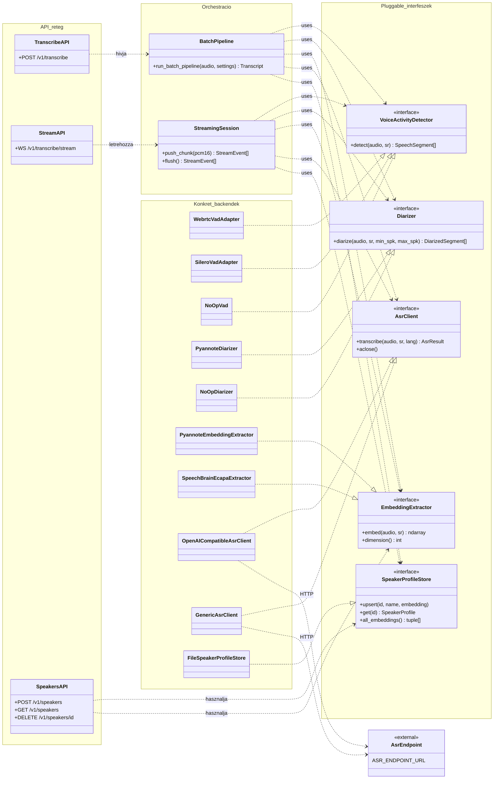

# Komponens-/interfész-diagram (UML Class Diagram jelöléssel)

Mermaid nem támogat natívan klasszikus UML Component Diagram jelölést
(komponens-dobozok + lollipop-interfészek), ezért a legpontosabb, valóban
szabványos UML-eszköz erre a **Class Diagram**, `<<interface>>` stereotype-
okkal, realizációs nyilakkal (`..|>`, üres háromszög — "ez az osztály
implementálja ezt az interfészt") és függőségi nyilakkal (`..>`, "ez az
osztály használja azt"). Ez pontosan visszaadja a worker pluggable-backend
architektúráját: az orchestrátorok (`BatchPipeline`, `StreamingSession`)
kizárólag az interfészeket (`app/core/interfaces.py`) ismerik, sosem a
konkrét implementációkat — ezt fejezi ki a diagramon, hogy a függőségi nyilak
mind az interfész-dobozokba mutatnak, nem a konkrét osztályokba.

**Hogyan olvasd:** minden `Konkret_backendek` névtérbeli osztály pontosan egy
interfészt valósít meg (`..|>`), és a `config.py`-ban megadott
`*_BACKEND` env-változó dönti el futásidőben, melyik konkrét osztály épül be
— az orchestrátorok kódja ettől függetlenül, változatlanul ugyanazt az
interfészt hívja. Egy új modell/könyvtár bevezetése tehát mindig egy új,
az adott interfészt megvalósító osztály hozzáadását jelenti, az
`Orchestracio` és `API_reteg` névterek egyetlen sorát sem érintve.
