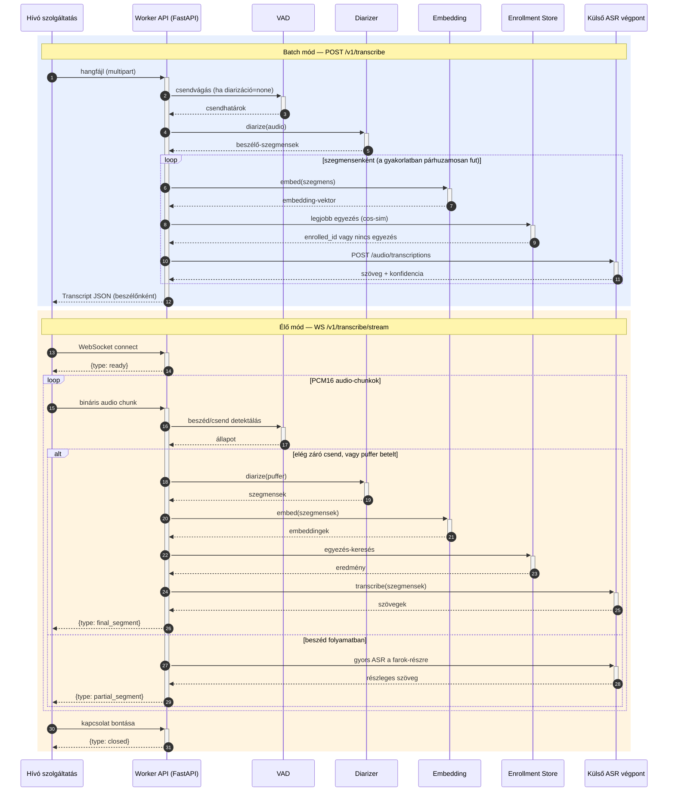

# Szekvenciadiagram — batch és élő mód

Szabványos UML szekvenciadiagram, minden szinkron hívásnál `+`/`-`
aktiváció-jelöléssel (a lifeline-okon megjelenő aktivációs sávok pontosan a
hívástól a válaszig tartanak). Ugyanaz a diagram szerepel a fő
[`README.md`](../../README.md) "Működés — szekvenciadiagram" szakaszában is —
ez a fájl az önálló, `docs/architecture/`-beli referencia-változata.

