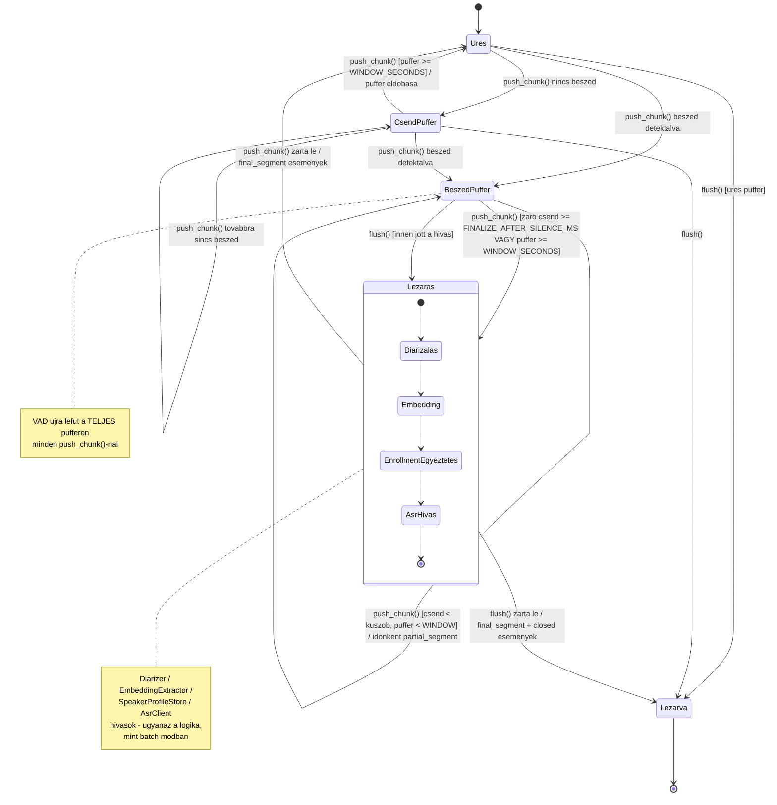

# Állapotgép-diagram — élő (`StreamingSession`) mód

A rendszer legbonyolultabb, időben változó viselkedésű része az élő
streaming-munkamenet (`app/core/streaming_pipeline.py`) — ezt egy statikus
flowchart rosszul adja vissza, egy szabványos UML **State Machine Diagram**
viszont pontosan: melyik állapotban milyen esemény milyen átmenetet vált ki,
és mikor keletkezik `partial_segment` / `final_segment` / `closed` kimenet.

**Hogyan olvasd:**
- **Üres / CsendPuffer / BeszédPuffer** — a rolling buffer élete: minden
  `push_chunk()`-nál a VAD újra lefut a teljes addig felgyűlt pufferen (nincs
  inkrementális VAD-állapot — ez a jelenlegi dizájn egy ismert, dokumentált
  jellemzője, ld. [`../manual_test_notes.md`](../manual_test_notes.md) 6.
  pont).
- **BeszédPuffer** öncímkés hurokéle jelzi a `partial_segment` kiadását —
  ez **nem** megy át diarizáción/enrollment-egyeztetésen, csak egy gyors ASR-
  hívás a folyamatban lévő beszéd farok-részére (alacsonyabb minőség, de
  azonnali visszajelzés).
- **Lezárás** egy összetett (nested) állapot: pontosan ugyanaz a
  diarizáció→embedding→enrollment-egyeztetés→ASR lánc fut le benne, mint
  batch módban — ez a garancia arra, hogy a **végleges** (`final_segment`)
  eredmények ugyanolyan minőségűek, mint a batch kimenet, csak a
  *részleges* eredmények (`partial_segment`) rosszabbak.
- **Lezárva** a terminális állapot — csak `flush()`-on (kapcsolat-bontás)
  keresztül érhető el.
